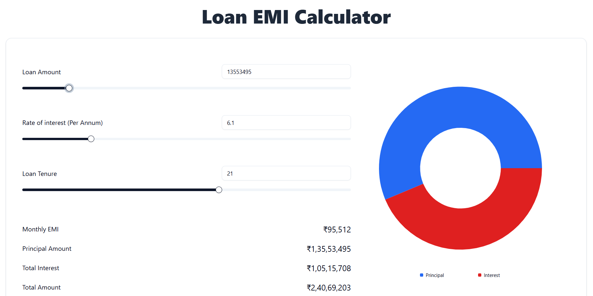

# Loan EMI Calculator

## Description

This is a **Loan EMI Calculator** built using **React (Vite)**, **TypeScript**, **Tailwind CSS**, and **ShadCN**. The application allows users to calculate their monthly EMI based on loan amount, interest rate, and tenure. It also visualizes the loan breakup using a donut chart.



## Features

- **Real-time EMI Calculation**: Updates EMI as inputs change.
- **Interactive Sliders & Inputs**: Users can adjust loan amount, interest rate, and tenure.
- **Dynamic Donut Chart**: Displays the breakup of principal vs. interest.
- **Modern UI with ShadCN Components**: Provides a clean and responsive design.

## Tech Stack

- **Frontend**: React (Vite), TypeScript
- **Styling**: Tailwind CSS, ShadCN
- **PieChart**: for visualization

## Installation

1. Clone the repository:
   ```bash
   git clone https://github.com/adarshdotdev/emi-calculator.git
   cd emi-calculator
   ```
2. Install dependencies:
   ```bash
   npm install
   ```
3. Start the development server:
   ```bash
   npm run dev
   ```
4. Open the app in the browser:
   ```
   http://localhost:5173
   ```

## Usage

1. Use the sliders or input fields to set the **Loan Amount**, **Interest Rate**, and **Loan Tenure**.
2. The **Monthly EMI** will update in real time.
3. View the total **Principal**, **Total Interest**, and **Total Amount**.
4. The donut chart visually represents the interest vs. principal split.
